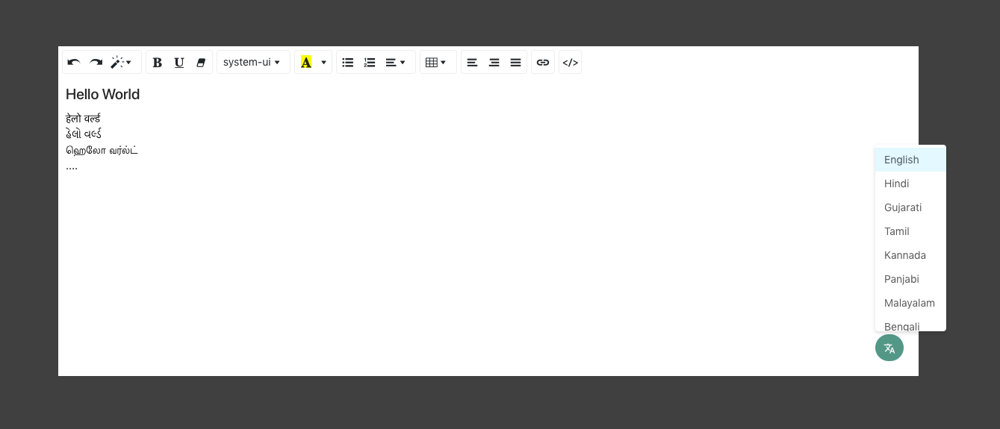

## React Rich Text Editor

#### Supports:

- Rich text editing.
- Code editing.
- Paste any content without loosing actual styles.
- Multi language supports.
- Customize image uploader.



#### Installation:
### `npm i react-rich-text-editor`

#### Plug into any app:
```
  import ReactRichEditor from 'react-rich-text-editor'
  ... 
  ...
  return(
    <ReactRichEditor height={200} />
  )
  ....

```
#### Props and usage:

##### `height` :
To set editor's height.
```
imageModel = { 200 }

```
###### Type: Number
###### Default: 500

##### `imageModel` :
Start image upload support by passing custom uploader.
```
imageModel = { <ImageUploader> }

```
###### Type: Element
###### Default: Null

##### `insertImage` :
Insert image into editor by passing url of image.
```
insertImage = { "http://example.com/image.jpg" }

```
###### Type: string
###### Default: ""

##### `languages` :
Customise language support by add/subtract new language.
```
languages={ [{
    "label": "English",
    "value": "english"
}] }
```
###### Type: Array
###### Default: All languages array
